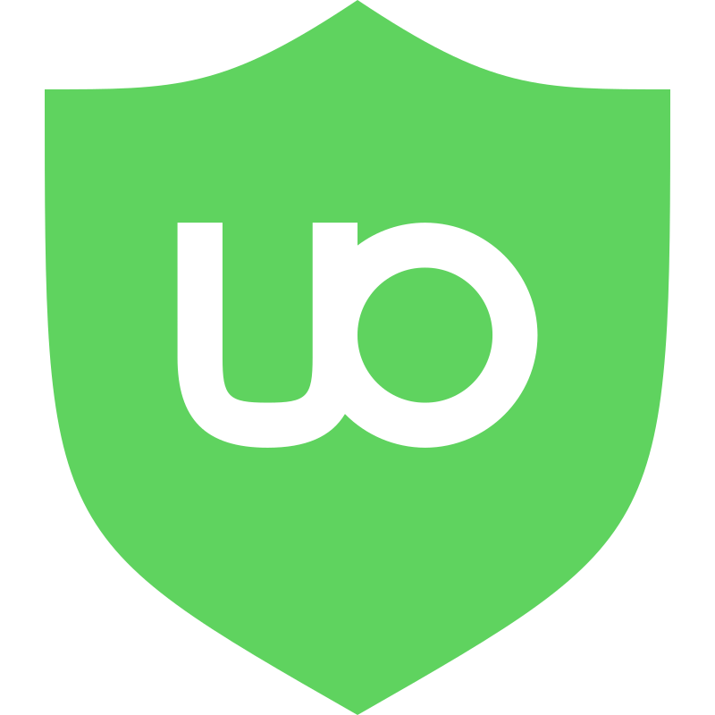

[![Contributors][contributors-shield]][contributors-url]
[![Forks][forks-shield]][forks-url]
[![Stargazers][stars-shield]][stars-url]
[![Issues][issues-shield]][issues-url]
[![MIT License][license-shield]][license-url]

<!-- PROJECT LOGO -->
 

  

<h3 align="center">Does uBlock bypass YouTube's anti-adblocker script?</h3>

  

    This website will tell you!
     
    <a href="https://drhyperion451.github.io/does-uBO-bypass-yt">View Website</a>
    ·
    <a href="https://github.com/drHyperion451/does-uBO-bypass-yt/issues">Report Bug</a>
    ·
    <a href="https://github.com/drHyperion451/does-uBO-bypass-yt/issues">Request Feature</a>
  

## Table of Contents

1. [Introduction](#introduction)
2. [How It Works](#how-it-works)
3. [Usage](#usage)
4. [Contributing](#contributing)
5. [Donations](#donations)
6. [Other Projects](#other-projects)
7. [Acknowledgments](#acknowledgments)

## Introduction

The uBlock Filters Update Checker is a tool that helps users of uBlock Origin, a popular ad-blocking browser extension, to stay informed about the status of their filters when it comes to blocking YouTube ads. This tool compares the latest filter maintained by [ublock volunteers](https://github.com/stephenhawk8054/misc/blob/main/yt-fix.txt) with [youtube anti-adbock script](https://pastefy.app/G1Txv5su/raw) to determine if the filters are up to date. This documentation provides detailed information on how to use and contribute to the project.

## How It Works

The uBlock Filters Update Checker functions by comparing the latest filter maintained by uBlock volunteers with YouTube's anti-adblock script. If the filter IDs match, it indicates that the filter is up to date. If the IDs do not match, it does not necessarily mean that uBlock is not working on YouTube. Instead, it serves as a recommendation to update your filters. The tool also advises users to report to uBlock if they still encounter ads after updating their filters.

**Note:** If the IDs do not match, please refrain from making a report to uBlock to prevent overloading their issue tracker.

## Usage

To use the uBlock Filters Update Checker, visit the website and follow these steps:

1. Access it [here](https://drhyperion451.github.io/does-uBO-bypass-yt/).

2. Check the status of your uBlock filters by comparing the filter ID provided on the website with the latest filter ID maintained by uBlock volunteers.

3. If the IDs match, your filters are up to date, and you should not encounter ads on YouTube.

4. If the IDs do not match, it's recommended to update your filters as soon as possible.

5. If you still see ads on YouTube after updating your filters, you may consider reporting the issue to uBlock Origin.

## Contributing

We welcome contributions to the uBlock Filters Update Checker project. Here's how you can get involved:

1. Fork the development branch of the project repository.

2. Make the necessary changes or improvements to the code.

3. Submit a pull request (PR) to the development branch. This helps prevent overloading GitHub pages deployment.

When contributing, please follow these best practices:

- Separate responsibilities: HTML is for information, CSS is for styling and animations, and JavaScript is for making the website interactive. This approach helps keep the JavaScript code clean.

- Use comments: Provide brief comments to explain the purpose of your functions and code snippets, making it easier for maintainers to understand your changes.

- Avoid external libraries: Stick to plain JavaScript for compatibility, speed, and minimal bloat, especially for simple static websites.

- Development tools: You can use Firefox Developer Edition to view the website locally, edit CSS, and debug JavaScript. VSCode is a suitable editor for HTML and JavaScript.

<b>Thanks for your contributions!</b>

## Donations

I do not accept donations. This project follows the same philosophy as the uBlock project, focusing on user privacy and avoiding tracking, as the web should have been from the beginning.

## Other Projects

Explore other projects at [drhyperion451.github.io](https://github.com/drHyperion451)!

## Acknowledgments

 
  <b>Special thanks to the uBlock Origin team for being so talented and developing the best antivirus software.</b>

[contributors-shield]: https://img.shields.io/github/contributors/drHyperion451/does-uBO-bypass-yt.svg?style=for-the-badge
[contributors-url]: https://github.com/drHyperion451/does-uBO-bypass-yt/graphs/contributors
[forks-shield]: https://img.shields.io/github/forks/drHyperion451/does-uBO-bypass-yt.svg?style=for-the-badge
[forks-url]: https://github.com/drHyperion451/does-uBO-bypass-yt/network/members
[stars-shield]: https://img.shields.io/github/stars/drHyperion451/does-uBO-bypass-yt.svg?style=for-the-badge
[stars-url]: https://github.com/drHyperion451/does-uBO-bypass-yt/stargazers
[issues-shield]: https://img.shields.io/github/issues/drHyperion451/does-uBO-bypass-yt.svg?style=for-the-badge
[issues-url]: https://github.com/drHyperion451/does-uBO-bypass-yt/issues
[license-shield]: https://img.shields.io/github/license/drHyperion451/does-uBO-bypass-yt.svg?style=for-the-badge
[license-url]: https://github.com/drHyperion451/does-uBO-bypass-yt/blob/dev/LICENSE
